---

# Hi there! 👋 I'm komatsu-3d (komatsu-ntl)

非エンジニアですが、AIの力を借りて「あ、これ便利かも」という道具を作るのをのんびり楽しんでいます。

---

### ⚾️ 好きなこと
- **MLBのデータを眺めること**
  試合はあまり見ずに、数字の進捗や相性を頭のなかで分析しています。

### 🚀 最近のあそび
- **ClaudeCode と GAS**
  ノーコードで「ちょっと便利なもの」をコツコツ作成中です。好きな言葉は「形式知」です...🔥

---

> [!TIP]
> コードのことは勉強中ですが、新しいツールを触るのは大好きです。
> ゆるく、楽しく、効率化。を目指して活動しています。よろしくお願いします！

---

### ⚾️ MLB My Focus Players (Auto-Updated)
####  Shohei Ohtani (LAD #17)
| Role | Stats |
| :--- | :--- |
| **Hitting** | .271 AVG / 5 HR / 11 RBI / 1 SB |
| **Pitching** | 2-0 W-L / 0.50 ERA / 18 SO / 0.72 WHIP |

####  Kyle Tucker (LAD #23)
| AVG | HR | RBI | SB | OPS |
| :--- | :--- | :--- | :--- | :--- |
| .244 | 3 | 13 | 3 | .705 |

####  Andy Pages (LAD #44)
| AVG | HR | RBI | SB | OPS |
| :--- | :--- | :--- | :--- | :--- |
| .366 | 5 | 21 | 4 | 1.009 |

---

## 📊 My Real Activity

---

### 🐰 My Special Bunny

  

> [!TIP]
> 垂れ耳うさぎを飼っています！

---
